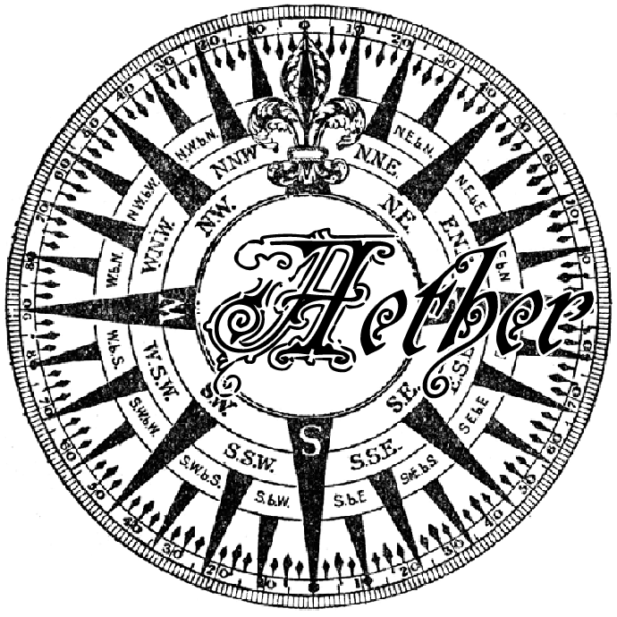
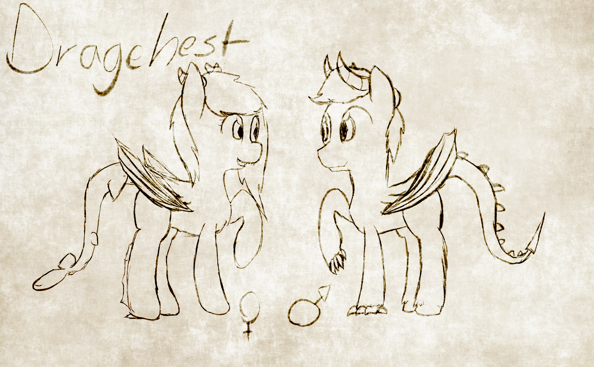

Aether Handbook

A Steampunk “My Little Pony: Friendship is Magic” Setting for Dungeons and Dragons Fifth Edition

Quick lore introduction: [http://pastebin.com/EnJiwJDk](https://www.google.com/url?q=http://pastebin.com/EnJiwJDk&sa=D&ust=1467528900101000&usg=AFQjCNH-noGjxJDwJuczvsy98Ca1-cPOnA)

* * * * *

Table of Contents
=================

[Additional Skills](#h.gqc64tnmokhd)

[Piloting (Wis)](#h.ctkbteejwb3q)

[Engineering (Int)](#h.tfqm2gryezzj)

[Gunning (Dex)](#h.wlequ1qko6bp)

[Races](#h.6kdekdfedl5u)

[Earth Pony](#h.ecoeue9053d3)

[Groundworker](#h.kl0uo07jhh94)

[Aeternalis Native](#h.gyqu7oi9903b)

[Pegasus](#h.s6app2fewd68)

[Cloud Harvester](#h.p412r96abz6m)

[Solis Warrior](#h.o0hduwsxwolf)

[Bat Pony](#h.o2fdyeuoki0s)

[Dream Walker](#h.6aulh4t17ial)

[Övärld Warrior](#h.7c08tiw1scce)

[Unicorn](#h.yg7m5knfm3uy)

[Strøm Student](#h.4gra5mjq07h4)

[Evershade Nomad](#h.7or1rcha71o)

[Crystal Pony](#h.dvvujncmjf5y)

[Övärld Ex-Worker](#h.vl11q2ixx53o)

[Mountain Dweller](#h.8zmr5romf48v)

[Dragehest](#h.tee5stvnllr3)

[Strøm Royalty](#h.e6559owdd2rn)

[Strøm Rebel](#h.pvznnlyi61ls)

[Breezie](#h.ajvln7vomnnd)

[Evershade Dweller](#h.lvvi9x4hawkz)

[Breeze Rider](#h.mlia1s3kex2y)

[Subspecies](#h.52senq15g2v1)

[Species Not Allowed](#h.b72g13hxs4ig)

[Additional Equipment](#h.mvovxdb5pxis)

[Black Powder Weapons](#h.5rw8too8lro7)

[Heavy Weaponry](#h.ifrj5ra7ijeu)

[Ammunition, Consumables and Other](#h.e0pdj97frh2m)

* * * * *

[Airship Combat](#h.x7vns7nfdi7n)

[Stats](#h.pew7vq7a7058)

[Boosts](#h.dttjrn1pa5z8)

[Repairs](#h.s2bbjff5t3z1)

[Repair DC’s](#h.ja7nm23zn9dw)

[Magic Energy](#h.5v1lz5vidzqv)

[Adjustments To Ranged Weapons](#h.grpgekdvtfub)

[Targeting](#h.7luqs7jbo5m0)

[Locations](#h.lk1biesdxk37)

[Natural Formations](#h.74ouokrqqabv)

[Regions](#h.g8gxl8pjorkf)

[Aeternalis, The Skyforge](#h.r90tu2oo5fvo)

[Cornea](#h.56ox62ykdcy1)

[Strøm](#h.x6bwownnzhg8)

[Övärld (Pronounced Uhr-vald)](#h.fp0fp3eg7xly)

[Solis](#h.o30amsiwqkea)

[Evershade](#h.38f95rhyrkxd)

[Major Cities](#h.5i8of55v13dp)

[Övärld, Snowfall](#h.kltvnflkm0q2)

[Solis, Archos](#h.onk7w65yvfxp)

[Strøm, New Canterlot](#h.swwdtshfas2z)

[Cornea, Bazaar](#h.5hwsrmpfudww)

[Evershade, Evershade Forest](#h.chh6qqpu1u7g)

[Minor Cities and Towns (Incomplete)](#h.ko30i69l0y4j)

[Cornea, Commonplace](#h.rny48gf6cp35)

[Cornea, Unterwald](#h.gwmlq4oqe005)

[Timeline / Events (Incomplete)](#h.bzq0ge5bmvhv)

[0 - The Divide](#h.6bgjnei8edr5)

[100 AD - Aeternalis, the first city in the sky, was founded](#h.vimmevhk1ye9)

[200 AD - The steam boiler was rediscovered](#h.r9nkfdt9wb29)

[Miscellaneous Information and Lore](#h.6cr6bvomsbfi)

[Military Ranks](#h.64ij7ms23woy)

[Religious Figures](#h.v18rfthrj3oi)

[The Church of the Alicorns](#h.dmte08fudtbq)

[The Belief of the Outsiders](#h.1nvw8cdcg83q)

[The Church of Harmony](#h.9uzoefnlxymd)

[Different Fuels](#h.lqlxwg8qnw58)

* * * * *

Additional Skills
=================

Due to the fact that DnD is not designed for this time period, I’m going to an additional few stats that are independent from your other ones.

Classes:

Fighters and Rangers may take Gunning as one of their selectable skill proficiencies.

Rogues may take Piloting as one of their selectable skill proficiencies.

Backgrounds:

Guild Artisans and Sages may take Engineering.

Outlanders and Sailors may take Piloting.

Soldiers may take Gunning.

Piloting (Wis)
--------------

Airships are a critical part of society in the Sky. Without owning one, or getting a ride from one, you can’t get anywhere. The piloting skill is useful in case you are ever behind the wheel of an airship, or other vehicle. This skill also applies to commanding an airship crew.

Engineering (Int)
-----------------

With the remains of the Industrial Revolution being salvaged, and new machines being created all the time in Aeternalis, engineering can be very useful at times. This applies to machine knowledge, repairs, and the creation of machinery.

Gunning (Dex)
-------------

Whether you are loading a powder cannon, or rapidly firing a massive magic laser turret, you know how to shoot with the big guns. This skill is used only on airship (or similar) guns. Small firearms use your DEX skill, like crossbows would.

* * * * *

Races
=====

Earth Pony
----------

Ability Score Modifier: Earth Ponies get one (1) additional point in STR

Languages: Common

Speed: Base walking speed is 40 feet.

### Groundworker

Groundworkers are the farmers of Old Equestria. They have increased ability in working with plants and ponies.

Ability Score Modifier: Groundworkers get one (1) additional point in CON or CHA

Proficiencies: Groundworkers may choose two (2) free proficiencies from Nature, Animal Handling, Survival, or Persuasion.

### Aeternalis Native

Aeternalis is a city of metal and fire, where machines are born and die. Having reigned from here, you have superior knowledge of machines.

Ability Score Modifier: Natives get one (1) additional point in CON or INT

Engineer: You gain proficiency in Engineering.

Social Standing: Ponies are usually appreciative of Aeternalis Natives for all the work they have done for the Sky.

Smithy: You have proficiency with the Smith’s Tools.

* * * * *

Pegasus
-------

Ability Score Modifier: Pegasi get two (2) additional points in DEX.

Languages: Common

Speed: Base walking speed is 30 feet, but your flying speed is 45.

Flight: Pegasi have feathery wings that allow flight.

### Cloud Harvester

Having harvested many clouds for different uses, you know how to navigate the Sky, and also are a fairly adept flier.

Frequent Flier: You gain +2 in any biological flight-based rolls. (Anything that involves your wings)

Airship Knowledge: You gain proficiency in Piloting.

Directionally Accurate: You have proficiency with the Navigator’s Tools.

Proficiencies: You gain proficiency in Acrobatics and Perception.

### Solis Warrior

You were born and raised in Solis, and so you were sent to war just like any other foals after you turned of age. You have much experience with guns.

Ability Score Modifier: Solis Warriors get one (1) additional point in CON or STR

Gunner: You often use guns in your conflicts with Övärldians. You get proficiency in Gunning, and +1 to all small firearm and crossbow damage.

Weapon Proficiency: You can get proficiency with Small Firearms and Crossbows.

Gunpoint: You gain +2 to Intimidation checks if you are using a ranged weapon to do so.

Hot Climate: You are not affected by mildly hot temperatures, and Fire attacks have disadvantage.

* * * * *

Bat Pony
--------

Ability Score Modifier: Bats get one (1) additional points in DEX or CON.

Night Vision: Bat Ponies have Darkvision.

SCREEEE: Bat Ponies have Blindsight via echolocation, but can only use it at the cost of being extremely loud.

Speed: Base walking speed is 30 feet, but your flying speed is 40.

Languages: Common

Flight: Bat Ponies have leathery bat-like wings that allow flight, though somewhat slower than their pegasus counterparts.

### Dream Walker

You are capable of wandering through the Dreamscape, like many other bat ponies. Whether you use this to help ponies or cause chaos is up to you.

Dreamscape Walking: You can visit other ponies dreams whenever you are in a long rest.

Ability Score Modifier: Dream Walkers get one (1) additional points in WIS or CHA.

Proficiency: You get proficiency in Insight, Perception, or Arcana.

Additional Languages: Nightspeech (The language of creatures in the dream realm)

Dream Magic: At 5th level, you gain the spell “Dream” for free as a cantrip. At 9th Level, you gain the spell “Astral Projection” for free (one time use per long rest if you have no spell slots), of which if you are casting it only on yourself, it does not require material components.

### Övärld Warrior

Similar to the Solis Warrior, you are battle trained and participated in the war. Unlike the Solis Warrior, you are more trained in swordplay.

Ability Score Modifier: Bats get one (1) additional points in DEX or STR.

Trained Against Guns: Small Firearms shooting at you have disadvantage, and you have advantage attacking enemies wielding a gun and no melee weapon.

Cold Climate: You are not affected by mildly cold temperatures, and Cold attacks have disadvantage.

Swordplay: You gain proficiency in Shortsword, Longsword, and Rapier. You start off owning a Shortsword or Rapier.

* * * * *

Unicorn
-------

Horny: Unicorns do not need a spell focus.

Speed: Base walking speed is 30.

Languages: Common

Basic Knowledge: All Unicorns can perform telekinesis. You start out with the spell “Magic Missile”, free.

### Strøm Student

You studied at a Strøm University, and have gained much magical knowledge, as well as learned some High Dragehest culture.

Ability Score Modifier: You may allot two (2) additional points in INT or CHA.

Proficiency: You gain proficiency in History, Arcana and Religion.

Arcane Magic: You start with the “Minor Illusion” or “Fire Bolt” spells, free.

Additional Languages: Draconic

Cultured: The people of High Strøm and other cultured peoples favor you.

### Evershade Nomad

Ability Score Modifier: You get two (2) additional points in WIS.

Proficiency: You gain proficiency in Nature, Arcana and Survival.

Nature Magic: You start with the “Cure Wounds” or “Healing Word” spells, free. At 5th level, you get the spell “Commune With Nature” for free.

* * * * *

Crystal Pony
------------

Cold Climate: You are not affected by mildly cold temperatures, and Cold attacks have disadvantage.

Speed: Base walking speed is 30.

Languages: Common

Crystal Body: You get +2 to your AC.

### Övärld Ex-Worker

You used to tend a crystal berry farm, or something similar in Övärld. You had to deal with hunger on a constant basis, until you left. You have been given refugee status, and will be accepted anywhere, with discounts on supplies.

Refugee: After the hard times you faced on the farm, ponies pity you. You get 20% lower prices on travel supplies and transportation.

Hunger Trained: You don’t get hungry or thirsty as fast.

Proficiencies: Ex-Workers may choose two (2) free proficiencies from Nature, Medicine, Survival, or Persuasion.

Ability Score Modifications: Ex-Workers get two (2) points in CON.

### Mountain Dweller

You grew up living off of the land in the Strøm Mountains. Hitchhiking by ship from island to island to get where you need to go.

Additional Languages: Draconic

Ability Score Modifications: Ex-Workers get one (1) point in CHA and DEX.

* * * * *

Dragehest
---------

Dragehest are a strange mixture of shark, dragon, and pony. They were caused by a magical mutation during the Divide. Male Dragehest tend to look more like their dragon part, with sharp claws on their forehooves, while females tend to look more on the shark side, with sharp fangs capable of tearing flesh.

Cold Climate: You are not affected by mildly cold temperatures, and Cold attacks have disadvantage.

Speed: Base walking speed is 30, flying and swimming speed is 45.

Flight: Dragehest have large, dragon-like wings that allow for flight. The shark-like tail allows for assisted aerodynamics and turning strength.

Languages: Common, Draconic

Carnivorous: You can only eat meat products. Females get a 1d4 + 1 piercing bite attack, and males get a 1d4 + 1 slashing claw attack.

### Strøm Royalty

You grew up in one of the many royal bloodlines of the Dragehest.

Wealth: You roll an additional 1d10 \* 5 when rolling beginning currency.

Social Standing: Many ponies will respect you, but there are also many who will despise you.

Ability Score Modifications: You get two (2) points in CHA.

Proficiencies: Ex-Workers may choose two (2) free proficiencies from Persuasion, Deception, Intimidation, and Arcana

### Strøm Rebel

You grew up in Strøm, but despise the tyrannical government. You have assisted in the sabotaging of many government events.

Sneaky: You gain proficiency in Stealth, and you can act as you would normally while stealthed in the water.

Proficiencies: You may choose two (2) free proficiencies from Deception, Sleight of Hand, Investigation and Perception.

Ability Score Modifications: You get two (2) points to distribute into DEX and CHA.

Social Standing: Most non-rebel Dragehest will despise you, but most other ponies will respect your actions.

Rebel Network: Rebels have a secret communications network in Strøm. While in Strøm, you can find anything you need.

* * * * *

Breezie
-------

Size: Tiny.

Speed: 10 feet on ground, 15 when flying with no current. 30 when flying with the current, 10 against.

Flight: Breezies have insect-like wings that allow them to fly along with the strong currents of the Sky.

Ability Score Modifications: +3 DEX, -1 STR, -1 CON, +1 CHA.

Unarmored Defense: While you are not wearing any armor, your Armor Class equals 10 + your Dexterity modifier + your Constitution modifier.

### Evershade Dweller

Like Unicorn Nomads, you lived deep within the Evershade Forest. Unlike the roving ponies, you set up a personal establishment in a small colony of other Breezies.

Strength In Numbers: When working with other Breezies, you gain advantage to all physical labor rolls like moving objects or swinging weapons.

Proficiencies: You get proficiency in Nature and Medicine.

Silence: You learned to be silent amongst the dangerous forest. You create no noise from movement.

### Breeze Rider

You spent lots of time riding the air currents around the Sky, letting it take you where it will. You’ve gone on many adventure where it’s taken you, and you’ve learned to trust it as your ally.

Windspeech: You can virtually commune with the wind. You are sometimes aware of nearby dangers.

Lone Traveller: You can function just fine on your own. You can not assist or be assisted in any rolls, but you can handle equipment up to twice your size and weight.

Proficiencies: You get proficiency in Insight and Survival.

Flow: You can ride wind currents without getting tired at speeds of up to 1 mph.

Wind Knowledge: You get +2 to any rolls involving the wind.

* * * * *

Subspecies
----------

Non show-canon or world specific species are allowed (ex. Kelpies, Lamias), or just species that aren’t listed here, just ask about it and I’ll write up some rules here.

Species Not Allowed
-------------------

It is unknown if they all died out, or if they never made it to the Sky in the first place, but Zebras, Deer, Minotaurs, and Diamond Dogs have never been seen since the Divide. Changelings are allowed, but discretion is advised when playing them, as they are usually viewed in a very hostile manner.

* * * * *

Additional Equipment
====================

Black Powder Weapons
--------------------

Most, if not all firearms deal piercing damage.

Reloading: You need to take a standard or move action to load the weapon. If you are not proficient in small firearms, then all firearms take a standard action to load.

<table>
<col width="16%" />
<col width="16%" />
<col width="16%" />
<col width="16%" />
<col width="16%" />
<col width="16%" />
<tbody>
<tr class="odd">
<td align="left">
Name
</td>
<td align="left">
Cost
</td>
<td align="left">
Damage
</td>
<td align="left">
Weight
</td>
<td align="left">
Properties
</td>
<td align="left">
Ammo
</td>
</tr>
<tr class="even">
<td align="left">
Flintlock Pistol
</td>
<td align="left">
30gp
</td>
<td align="left">
1d6
</td>
<td align="left">
1 lb
</td>
<td align="left">
Ranged (70, 180), Light, Loading
</td>
<td align="left">
1 ball
</td>
</tr>
<tr class="odd">
<td align="left">
Revolver
</td>
<td align="left">
60gp
</td>
<td align="left">
1d10
</td>
<td align="left">
1 lb
</td>
<td align="left">
Ranged (100, 20), Light, Reloading
</td>
<td align="left">
6 bullets
</td>
</tr>
<tr class="even">
<td align="left">
Musket
</td>
<td align="left">
40gp
</td>
<td align="left">
1d8 + 1
</td>
<td align="left">
10 lbs
</td>
<td align="left">
Ranged (200, 350), Reloading
</td>
<td align="left">
1 ball
</td>
</tr>
<tr class="odd">
<td align="left">
Scattergun
</td>
<td align="left">
50gp
</td>
<td align="left">
1d8
</td>
<td align="left">
7 lbs
</td>
<td align="left">
Ranged (60, 120), Loading, +2 to hit
</td>
<td align="left">
1 shell
</td>
</tr>
<tr class="even">
<td align="left">
Shotgun
</td>
<td align="left">
80gp
</td>
<td align="left">
1d12
</td>
<td align="left">
8 lbs
</td>
<td align="left">
Ranged (100, 150), Reloading, +2 to hit
</td>
<td align="left">
2 shells
</td>
</tr>
<tr class="odd">
<td align="left">
Rifle
</td>
<td align="left">
80gp
</td>
<td align="left">
1d12 + 2
</td>
<td align="left">
9 lbs
</td>
<td align="left">
Ranges (200, 500), Reloading
</td>
<td align="left">
6 bullets
</td>
</tr>
</tbody>
</table>

* * * * *

Heavy Weaponry
--------------

Weaponry that is too big for most ponies to carry and use. Heavy weaponry (and airship combat in general) is done in ranges of Close, Short, Medium, Long, and Far. You may fire a weapon at up to one range higher than as labelled, but you will be at disadvantage.

<table>
<col width="14%" />
<col width="14%" />
<col width="14%" />
<col width="14%" />
<col width="14%" />
<col width="14%" />
<col width="14%" />
<tbody>
<tr class="odd">
<td align="left">
Name
</td>
<td align="left">
Damage
</td>
<td align="left">
Size (T, S, M, L)
</td>
<td align="left">
Range
</td>
<td align="left">
Load Action*
</td>
<td align="left">
Ammo
</td>
<td align="left">
Cost
</td>
</tr>
<tr class="even">
<td align="left">
Powder Cannon
</td>
<td align="left">
2d12 + 5
</td>
<td align="left">
Small
</td>
<td align="left">
Medium
</td>
<td align="left">
Standard
</td>
<td align="left">
1 Cannonball
</td>
<td align="left">
150 gp
</td>
</tr>
<tr class="odd">
<td align="left">
Mounted Rifle
</td>
<td align="left">
4d4
</td>
<td align="left">
Tiny
</td>
<td align="left">
Short
</td>
<td align="left">
Bonus
</td>
<td align="left">
1 Clip
</td>
<td align="left">
100 gp
</td>
</tr>
<tr class="even">
<td align="left">
Gatling Turret
</td>
<td align="left">
6d4 + 2
</td>
<td align="left">
Small
</td>
<td align="left">
Medium
</td>
<td align="left">
Standard
</td>
<td align="left">
1 Clip
</td>
<td align="left">
200 gp
</td>
</tr>
<tr class="odd">
<td align="left">
A.I.D.**
</td>
<td align="left">
Disables Magic on ship and crew for two turns.
</td>
<td align="left">
Medium
</td>
<td align="left">
Medium
</td>
<td align="left">
Auto 5***
</td>
<td align="left">
10 MP
</td>
<td align="left">
1000 gp
</td>
</tr>
<tr class="even">
<td align="left">
Flamethrower
</td>
<td align="left">
4d4 (2d4 per turn on fire)
</td>
<td align="left">
Medium
</td>
<td align="left">
Close
</td>
<td align="left">
Auto 2
</td>
<td align="left">
5 MP
</td>
<td align="left">
550 gp
</td>
</tr>
</tbody>
</table>

\*Load action is what kind of actions can be taken to reload the weapon

\*\*Arcane Instability Director. Essentially is a magic EMP.

\*\*\*Heavy Magic Weaponry and other similar weapons don’t need a pony to reload them, but they still take time. You don’t have to take an action to reload, but it takes the amount of turns listed after shooting before it can fire again.

* * * * *

Ammunition, Consumables and Other
---------------------------------

<table>
<col width="33%" />
<col width="33%" />
<col width="33%" />
<tbody>
<tr class="odd">
<td align="left">
Name
</td>
<td align="left">
Cost
</td>
<td align="left">
Weight
</td>
</tr>
<tr class="even">
<td align="left">
Small Firearm Ammo
</td>
<td align="left">

</td>
<td align="left">

</td>
</tr>
<tr class="odd">
<td align="left">
Ball Ammo (x25)
</td>
<td align="left">
5 gp
</td>
<td align="left">
1 lb
</td>
</tr>
<tr class="even">
<td align="left">
Bullet Ammo (x60)
</td>
<td align="left">
10 gp
</td>
<td align="left">
1 lb
</td>
</tr>
<tr class="odd">
<td align="left">
Shell Ammo (x20)
</td>
<td align="left">
5 gp
</td>
<td align="left">
1 lb
</td>
</tr>
<tr class="even">
<td align="left">
Heavy Ammo
</td>
<td align="left">

</td>
<td align="left">

</td>
</tr>
<tr class="odd">
<td align="left">
Cannonball Ammo (x5)
</td>
<td align="left">
10 gp
</td>
<td align="left">
10 lbs
</td>
</tr>
<tr class="even">
<td align="left">
Clip Ammo (x5)
</td>
<td align="left">
10 gp
</td>
<td align="left">
5 lbs
</td>
</tr>
<tr class="odd">
<td align="left">
Mana Battery (15 MP)
</td>
<td align="left">
20 gp
</td>
<td align="left">
15 lbs
</td>
</tr>
<tr class="even">
<td align="left">
Airship Addons
</td>
<td align="left">

</td>
<td align="left">

</td>
</tr>
<tr class="odd">
<td align="left">
Mana Capacitor (+10 to max ship MP)
</td>
<td align="left">
100 gp
</td>
<td align="left">
40 lbs
</td>
</tr>
</tbody>
</table>

* * * * *

Airship Combat
==============

Airship combat is done similarly to normal combat, but when no boarding has occurred, then all turns will be taken simultaneously. Initiative will only be rolled after boarding has occurred.

Stats
-----

Airships have four main stats:

HP: The amount of hull damage the airship can take overall before structural integrity collapses and the airship is destroyed.

MP: The amount of storable magic energy the airship has. Used usually only for magic equipment on the ship. If you have no magic equipment, there is no need to have MP.

Speed: How fast the ship can go. This can be decreased via damage to the engines or power supply.

Buoyancy: How well the ship can stay afloat. This can be decreased bia damage to the balloon or degrading of the balloon components.

Example Airship:

(Prefix) Name, Classification

HP: 125/125

MP: 0/0

Speed: 20/20

Buoyancy: 20/20

Weaponry:

Forward Facing Mounted Rifle

Starboard Facing Powder Cannon

Port Facing Powder Cannon

Ammunition:

15 cannonballs

10 clips

Specifications:

Balloon Cloud Type: Aethercloud

Propulsion: (Coal) Steam Engine

* * * * *

Boosts
------

Airship stats can be boosted through different means, like upgrades or different fuel types.

A boostable stat looks like the following.

Speed: 20/20(40)

The stat’s normal max is 20, but upon activating whatever boost it has installed, the max will raise to 40. The current stat will raise by the difference of the max, so say the engines were damaged to the point where they are 15, it would raise to 35. If the speed is at 20 when you boost to 40, but sustain damage down to 30, when the boost wears off, it will go down to 10. Negative value always round up to 0.

Repairs
-------

As mentioned above, damage can be sustained in certain systems on the airship, or just in general. Repairs are done to the HP of the ship, or specific systems, not both. Repairs run off of your Engineering skill, where you roll against certain DC’s depending on the environmental conditions, and then roll your repair tool’s dice. If you do not have any repair tools, the default repair die is 1d8.

### Repair DC’s

<table>
<col width="50%" />
<col width="50%" />
<tbody>
<tr class="odd">
<td align="left">
Condition
</td>
<td align="left">
DC
</td>
</tr>
<tr class="even">
<td align="left">
Parked
</td>
<td align="left">
5
</td>
</tr>
<tr class="odd">
<td align="left">
Outside Combat
</td>
<td align="left">
7
</td>
</tr>
<tr class="even">
<td align="left">
Inside Combat
</td>
<td align="left">
10
</td>
</tr>
<tr class="odd">
<td align="left">
Flaming
</td>
<td align="left">
15
</td>
</tr>
<tr class="even">
<td align="left">
Grappled
</td>
<td align="left">
13
</td>
</tr>
<tr class="odd">
<td align="left">
Falling
</td>
<td align="left">
15
</td>
</tr>
<tr class="even">
<td align="left">
A.I.D.ed. (Only on disabled magic systems. Successful repair restores power.)
</td>
<td align="left">
15
</td>
</tr>
</tbody>
</table>

Magic Energy
------------

Magic energy is stored in Mana Capacitors, which can be bought at most major docks or repair places. Mana is refilled to max whenever you dock, or by using a Mana Battery.

Magic Energy is expended via magic engines, balloon equivalent, or weaponry.

Magic engines expend 1 MP every 2 miles when travelling at normal speeds. It costs 1 MP every for every turn you boost engines in combat.

Adjustments To Ranged Weapons
-----------------------------

When firing hoof-held ranged weapons from one airship to another, you may fire even if out of range. The hit will be rolled against AC, with adjustments that the DM finds adequate.

You may only fire hoof-held ranged weapons at another ship when within Short, or Close range, unless the weapon has really far range. Firing at Short range when a weapon has highest capable range of 400 or lower causes you to have disadvantage.

Targeting
---------

When firing at another airship, you must specify where you are shooting. There are three main areas that you can shoot: Hull, Balloon, or Engines. You may only target one area at a time.

Attacks against the Hull deal damage to the HP, and are generally where you want to shoot after taking down systems.

Attacks against the Engines or the Balloon hinder speed, rotation, and buoyancy. Bringing the Engines down to 0 will cause the airship to cease movement, and bringing the balloon to 0 will cause the airship to begin falling.

When targeting the hull, you can specify an area. (Ex, “Fire at the cannon that is about to fire at us”). This can cause weapons or crew to be damaged, and might help better than firing randomly. This is optional, and the DM will assume that you are firing at a random area of the hull if you do not specify otherwise.

* * * * *

Locations
=========

Natural Formations
------------------

The Eye: The empty center of the rotating wind currents in the sky. The current’s get stronger as you get closer, reaching near Barrier Storm levels of danger. There is an island in the Eye, said to contain bountiful treasure. Many adventurers have tried to reach it, but all have failed. The hurricane-like winds extend all the way up until there is no air anymore, so going over it would be impossible. The Eye is the main point of reference for locations on most maps.

(Air currents move counter-clockwise. It takes half as long to going with the current compared to against it. It takes two weeks to travel a full circle with the current, so long as you don’t get too close to the Eye.)

Evershade Forest: A portion of the Everfree Forest that was brought up to the Sky after The Divide.

### 

### 

* * * * *

### 

Regions
-------

### Aeternalis, The Skyforge

A massive city constructed by earth ponies back before the Divide. Located at 15000 m, and northeast of the Eye. While Aeternalis is more of a City than a region, it’s is considered the latter due to it’s size in comparison to all other cities.

Naming conventions: Same as Equestrian naming, with vague ancestry from old apple family names.

* * * * *

### Cornea

One of the five Regions in the Sky. Very Wild West-esque. Full of adventurers, many on the quest to enter the Eye, though many others doing other things. Geography is very similar to a savanna. Population is a melting pot of all the races. Average altitude is around 4000 m, making it the lowest, and hottest, of all the regions. Southeast of the Eye.

Naming conventions: Literally anything goes. Equestrian names are common, but due to Cornea’s society being a mixture of all cultures, you can choose any names from other countries.

Common Enemies: Bandits.

### Strøm

Very uptight society; Very royal. The citizens like to joke and make fun of other regions for being inferior to them, socially. Geography is mountainous, though it’s essentially an ocean in the sky. It most prominent race is the Dragehest, a species of carnivorous fish/dragon-like ponies that were brought about as one of the many species mutations caused by The Divide (essentially sky-seaponies). The main food product there is Aertrout, a type of fish that was also struck by some of The Divide’s magic, causing it to gain the same magic properties of Aethercloud. It is located, at average, 6500 m. Southwest of the Eye.

Naming conventions: Norwegian nouns, usually one word. (Usually there are many similar names, if not ones that are exactly the same. Royal Families usually are two-word (adjective-noun) names, with the noun staying the same. Commoners usually just stick with the one noun.)

Common Enemies: Serpents and Dragon-like creatures.

### Övärld (Pronounced Uhr-vald)

Övärld is an archipelago of snowy islands and glaciers. Sitting at over 7000 m, the temperature is even lower than Strøm’s. It’s two main inhabitants, Crystal Ponies and Bat Ponies, are already adapted to the cold, though the latter not as much. Because of the constant ice and snow, it is difficult to grow crops. They were forced to trade their abundance of metals and minerals in the soil for food from Aeternalis.

Naming conventions: Traditional Equestrian names, usually cold or night themed.

Common Enemies: Golems, Solis Warriors.

### Solis

Solis is the polar opposite to Övärld; Large expanses of desert, floating on sandstone at 2500 m. Solis and Övärld have always been competing with each other. Ever since they started trade with Aeternalis, they have been trying to one-up the other. Eventually, it went up to full scale war, with Solis’s Pegasi, the main inhabitant, going up against Övärld’s bats.

Naming conventions: Traditional Equestrian names, usually heat or day themed.

Common Enemies: Fire Elementals, Mummies, Övärld Warriors.

### Evershade

Names after its central land mass, The Evershade Forest, Evershade is a nomadic region, governed by magical artefacts called the Choosing Stones.

Naming conventions: Latin adjectives, one word.

Common Enemies: Timberwolves, Lamia, Spider ponies, other magically mutated creatures.

Major Cities
------------

### Övärld, Snowfall

The capital of Övärld, Snowfall is a city built inside of a massive mountain of ice, with a large crystal berry farm outside.

### Solis, Archos

The capital of Solis, a large pyramid on the top of the island, but is actually more of a gem shape, as It extends down through the sandstone and protrudes out the bottom of the island.

### Strøm, New Canterlot

New Canterlot is actually still the old canterlot castle, but it and it’s mountain were carried up to the sky, and in doing so, the castle was almost completely destroyed. Over time, it was rebuilt, and its design stayed vaguely the same. Dragehest architecture has been very influenced by old Canterlot design.

### Cornea, Bazaar

The Bazaar isn’t really the capital of Cornea, but it’s the closest thing they have. Cornea practically governs itself, where everypony votes on making decisions. The Bazaar is a massive, pony-built airship that contains the Sky’s largest marketplace. Need to buy something? It’s at the Bazaar. Need to get something made? It’s there. Need to hire somepony? They are there.

### Evershade, Evershade Forest

Evershade doesn’t have a government, as it is nearly completely comprised of nomads. The Evershade Forest, the forest of which the region gots its name from, is the closest thing to a central location. It originally began as a portion of the Everfree Forest, but after it rose up, it began to change. It became slightly more tame, with only the races that know how to work together surviving. Over time, trees grew more and more, causing overcrowding. The canopy is so thick in some places, that it’s as dark as the deepest cave.

### 

* * * * *

### 

### 

Minor Cities and Towns (Incomplete)
-----------------------------------

### Cornea, Commonplace

A decently sized town placed on a slanted island. A generic RPG town, with taverns, a market, any simple supplies you might need, and most importantly, work. A good starting place for any adventure.

### Cornea, Unterwald

One of Cornea’s larger cities. Positioned underneath another forested floating island, it’s Germane name literally means “Underforest”.

* * * * *

Timeline / Events (Incomplete)
==============================

BD - Before Divide

AD - After Divide

### 0 - The Divide

Starting on February 15th and ending on November 22nd, The Divide was a massive worldwide event that changed the world forever. Nopony knows what caused it, but theories say that the start of the Industrial Revolution, with all of it’s increased magic usage, had caused excess magic to pollute the clouds, causing them to inherit magical properties. Some gained the ability to support weight, while some became extremely volatile and dangerous. The last day of The Divide was when enough volatile clouds had built up in the Barrier Storm to blot out the entire sky, all around the world. At this moment, a massive storm began, lasting an entire week. Lightning cracked from the sky, rain and hail pelted down. Tornadoes, Hurricanes and the like assaulted the world, and many a pony lost their lives. After the storm subsided, there was enough magic soaked into the ground to cause floating islands to rise from the ground. These rose above the Barrier Storm, and carried ponies with them. Few survived, but over the years, cities reformed and technology was rediscovered from the old fragments of machines that were carried up with them.

The Alicorns of Equestria went missing immediately after The Divide. Nopony knows their location, or if they are even still alive.

### 100 AD - Aeternalis, the first city in the sky, was founded

On June 17th, 100 AD, Aeternalis was founded. Being the first city to be founded, it also was the largest. Originally, Aeternalis had been the Sweet Apple Acres, a massive farm on the outskirts of a small town that housed one of the fabled Alicorns. The entire farm was lifted into the sky, plus some of the surrounding area. This was partially caused by the close proximity to the Everfree Forest, and the magic it contributed. The magic of the Everfree essentially amplified the magic from the Barrier Storm, causing the island to be as large as it is, and it also floated high above all the other islands, resting at 10,000 meters above the Barrier Storm. This allowed them access to different types of cloud. One type, the Embertuft, was flammable. The abundance of this cloud meant that the cold temperature that high up hardly affected them. Survival up in the Sky was also made possible by all the trees that were carried up, allowing oxygen to flow where it normally couldn’t. Embertuft clouds also helped bring about Aeternalis’s second name, The Skyforge, because of the large amount of metalsmithing that it allowed. This creation of the Skyforge wouldn’t come to pass for another five hundred years, when supply ships could be made to go that high, so Aeternalis could get rid of it’s farms and create the forge.

At 100 AD, Aeternalis was still a farming town, but it was the biggest and highest populated out of all of the islands (sitting at a massive 1000 ponies, which was a lot for sky islands at the time), so Apple Skies, the direct descendant of Apple Bloom, founded Aeternalis as the first city in the sky.

### 200 AD - The steam boiler was rediscovered

After ponies found out that Aethercloud, the most common type of cloud in the Sky, could keep objects afloat other than itself, transit between islands became a more realistic possibility, and much cheaper than building multi-mile-long bridges. After the steam boiler was rediscovered, airships were constructed and transit was possible between islands.

* * * * *

Miscellaneous Information and Lore
==================================

Military Ranks
--------------

Acting Civilian - An untrained crew member, abbreviated to AC.
Shipmate - An average crewmember.
Ship Captain - In charge of a ship and crew.
Specialist - Not usually on ships, but acts behind the scenes for recon and assassination.
Commander - In charge of squadrons of ships.
Captain - In charge of the tactics and deployment of squadrons.
Fleet Commander - In charge of the tactics and deployment of fleets.

Religious Figures
-----------------

### The Church of the Alicorns

A church that views the old Alicorns as goddesses. Found mostly in Strøm and Aeternalis.

Celestia, Goddess of Creation

Luna, Goddess of Conception

Cadenza, Goddess of Love

Sparkle, Goddess of Harmony

### The Belief of the Outsiders

A general consensus amongst a group of ponies that these figures came from outside this world and helped carry the world into glory via conflict. Found mostly in Solis and Övärld.

Eris, Deity of Chaos

Umbrum, Deities of Hatred

Calyx, Creatures of Deception

Erebus, Deity of Doubt

Grogar, Deity of War

### The Church of Harmony

A church that holds the six elements of harmony (the elements themselves, mostly, but by implication their bearers) in higher regard than the Alicorns. Found mostly in Cornea and Evershade.

Magic, Depiction of Intelligence

Honesty, Depiction of Strength

Loyalty, Depiction of Dexterity

Generosity, Depiction of Charisma

Laughter, Depiction of Constitution

Kindness, Depiction of Wisdom

Different Fuels
---------------

Coal: Pretty simple, average fuel. Speed, 20.

Embertuft: Burns about the same speed as coal, but if magic energy is applied, then it burns significantly faster. Useful in airships for boosting the engines for a short time. Speed, 20 (Boostable to 40. Requires a Unicorn or MP, doesn’t consume magic, but is consumed three time as fast.)
